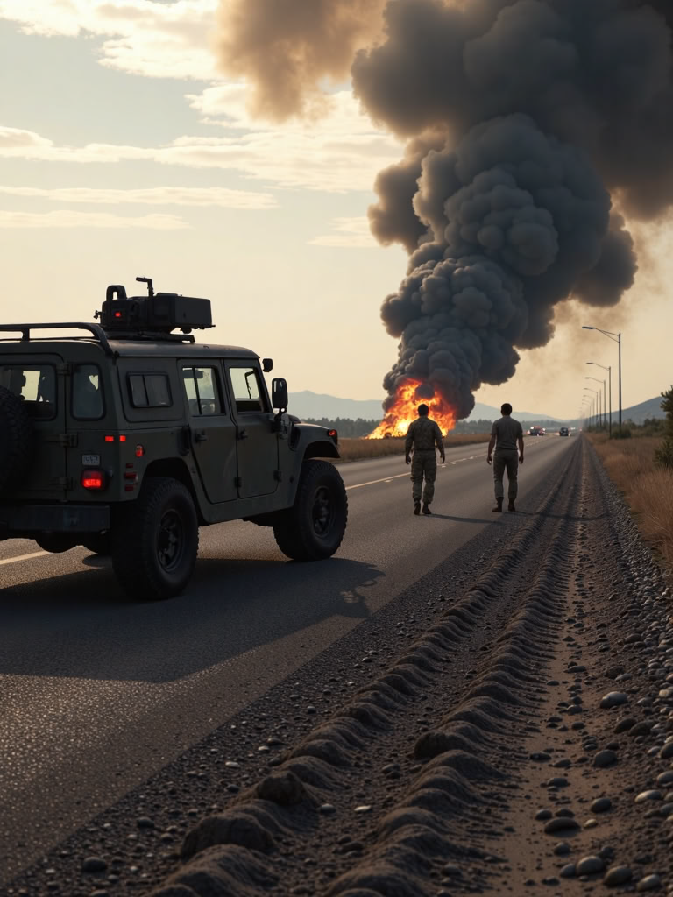

### "Трагедия на дорогах: Авария с участием военнослужащих в США"

**Суммаризация:**

В апреле 2025 года произошла трагическая авария, в которой погибли два военнослужащих и один получил серьезные ранения. Инцидент произошел на границе США и Мексики, где были развернуты около 10,000 активных служащих после указов президента Дональда Трампа. В результате аварии погибли два военнослужащих, имена которых не раскрываются до уведомления их семей.

**Мое мнение:**

Дорожно-транспортные происшествия с участием военных всегда вызывают глубокую озабоченность и сочувствие. В данном случае, несмотря на то, что авария произошла вне зоны боевых действий, она все равно привела к трагическим последствиям. Это подчеркивает необходимость повышения уровня безопасности для военнослужащих, особенно тех, кто выполняет миссии в условиях, отличных от боевого поля.

Военные операции на границе часто сопряжены с повышенным риском, и такие инциденты являются напоминанием о важности тщательных расследований и принятия мер по предотвращению подобных трагедий в будущем. Важно также обеспечить поддержку семьям погибших военнослужащих, чтобы они не оставались одни в этот трудный момент.

Информационная прозрачность также играет ключевую роль. Хотя имена погибших пока не раскрываются, это понимается в контексте поддержки семей, важно обеспечить доступ к информации для общественности, чтобы сохранить доверие и прозрачность.

1. **Безопасность военных операций**: Важно проводить тщательные расследования таких инцидентов и принимать меры для повышения безопасности военнослужащих, особенно тех, кто работает в условиях, отличных от боевых действий.
2. **Поддержка семей погибших**: Семьи погибших военнослужащих нуждаются в поддержке и уведомлении о происшествии. Это подчеркивает важность быстрой и чувствительной работы правоохранительных органов.
3. **Информационная прозрачность**: Хотя имена погибших пока не раскрываются, это шаг, который можно понять в контексте поддержки семей, но также важно обеспечить доступ к информации для общественности, чтобы сохранить доверие и прозрачность.

### Источники

Для получения дополнительной информации и подтверждения данных можно обратиться к следующим источникам:

1. [BNO News](https://bnonews.com/index.php/2025/04/2-service-members-killed-1-seriously-injured-in-military-vehicle-crash-near-el-paso-texas/)
2. [Fox 10 Phoenix](https://www.fox10phoenix.com/news/us-service-members-killed-hurt-vehicle-accident-us-mexico-border)
3. [Military.com](https://www.military.com/daily-news/2025/04/16/2-marines-killed-one-serious-condition-after-vehicle-incident-during-southern-border-mission.html)
